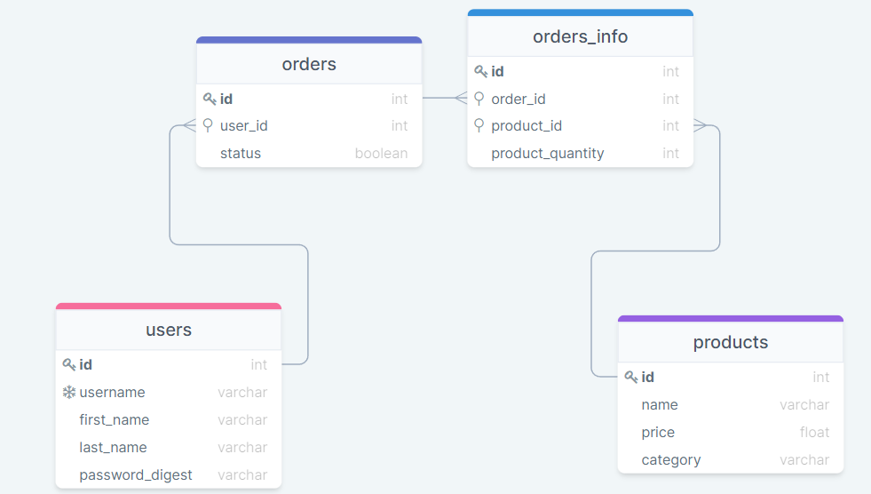

# API Requirements

The company stakeholders want to create an online storefront to showcase their great product ideas. Users need to be able to browse an index of all products, see the specifics of a single product, and add products to an order that they can view in a cart page. You have been tasked with building the API that will support this application, and your coworker is building the frontend.

These are the notes from a meeting with the frontend developer that describe what endpoints the API needs to supply, as well as data shapes the frontend and backend have agreed meet the requirements of the application.

## API Endpoints

All endpoints start with `/api` followed by the desired route name.
All endpoints that require tokens must have the token sent in the request header "x-auth-token".

#### Products

-   **Index** : GET `/product` (optional query for name, price and category)
-   **Show** : GET `/product/:id`
-   **Create** : POST `/product` [token required]
-   **Update** : PUT `/product/:id` [token required]
-   **Delete** : DELETE `/product/:id` [token required]

#### Users

-   **Index** : GET `/user` [token required] (optional query for username, first_name, last_name)
-   **Show** : GET `/user/:id` [token required]
-   **Create** : POST `/user`
-   **Login** : POST `/user/login` (returns token in the reponse body)
-   **Update** : PUT `/user/me` [token required]
-   **Delete** : DELETE `/user/me` [token required]

#### Orders

-   **Index** : GET `/order` [token required]
-   **IndexComplete** : GET `/order/complete` [token required]
-   **Show** : GET `/order/:id` [token required]
-   **Create** : POST `/order` [token required]
-   **Update** : PUT `/order/:id` [token required]
-   **Delete** : DELETE `/order/:id` [token required]

## Data Shapes

#### Product

-   id [INTEGER, SERIAL, PK]
-   name [VARCHAR(100), NOT NULL]
-   price [FLOAT, NOT NULL]
-   category [VARCHAR(50)]

#### User

-   id [INTEGER, SERIAL, PK]
-   username [VARCHAR(50), NOT NULL, UNIQUE INDEX]
-   firstName [VARCHAR(50)]
-   lastName [VARCHAR(50)]
-   password_digest [VARCHAR(60), NOT NULL]

#### Orders

-   id [INTEGER, SERIAL, PK]
-   user_id [INTEGER, INDEX, FK(users.id)]
-   status [Boolean (false = active, true = complete), NOT NULL]

#### Orders_info

-   id [INTEGER, SERIAL, PK]
-   order_id [INTEGER, NOT NULL, INDEX, FK(orders.id)]
-   product_id [INTEGER, NOT NULL, INDEX, FK(products.id)]
-   product quantity [INTEGER, NOT NULL]

## Database Schema

